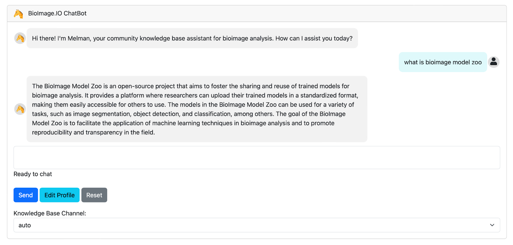

# Design and Functionality of BioImage.IO ChatBot: A User Guide and Technical Overview

## ChatBot Interface

After following the installation guidelines from the [README](/README.md), the chat interface will resemble Figure 1.

*Figure 1. The chat interface of the BioImage.IO ChatBot.*

Users can input their profiles as depicted in Figure 2. 

*Figure 2. Users can personalize responses by clicking `Edit Profile` and save their settings for future conversations by clicking `Save`.*

As of today, our chatbot utilizes knowledge bases from the following pivotal communities: bioimage.io [2], Imjoy [3], deepimageJ [4], ImageJ [5], bio.tools [6], and scikit-image [7]. A key feature allows users to specify a preferred channel for information retrieval, as shown in Figure 3. If a channel is designated, the chatbot sources information from that specific community. Otherwise, it uses an intelligent selection process driven by a schema-based agent to choose the most relevant channel based on the user's query.

*Figure 3. Users can personalize the conversation by selecting a specific channel from the ‘Knowledge Base Channel’.*

### Building the Knowledge Base

The knowledge base is efficiently and collaboratively constructed by downloading documentation from given URLs. These can be repositories, PDFs, or other forms of documentation. We use a regular expression splitter to segment the documentation into manageable chunks for efficient and accurate retrieval. These chunks are then embedded and stored as vectors in a FAISS [1]-based vector database.

## Schema-Based Agent Design and Response Examples

The chatbot's ability to understand and respond to user queries is substantially improved by employing a schema-based agent design. Unlike traditional context-based models, our approach utilizes predefined schemas to guide the conversation and information retrieval process. 

The schema-based agent operates on the function-call LLM [8], and uses input and output schemas to generate text output. Within this implementation, we construct a customer service chatbot by defining a role class, as shown in Figure 4.

*Figure 4. Creation of a chatbot role class named ‘CustomerServiceRole’ by defining fields of the role class.*

### Response Modes

Three distinct response modes have been designed to optimize the chatbot's utility:

1. **Direct Response**: For straightforward queries, the chatbot generates concise and accurate answers directly from its pre-configured profile (see Figure 6).

    
    *Figure 6. Direct response for simple queries.*

2. **Response with Text-Based Retrieval**: For complex or specific questions, the chatbot extracts key queries from the user's question and retrieves information from relevant documentation (see Figure 7).

    
    *Figure 7. Text-based retrieval from the knowledge base.*

3. **Response with Script Generation and Execution**: For advanced queries requiring specific model details or actions, the chatbot dynamically generates and executes tailored scripts (see Figure 8).

    
    *Figure 8. Script generation and execution for advanced queries.*

### Customization Examples

Customization is vital, particularly in the dynamic field of bioimage analysis. We leverage the flexibility of our schema-based agent to accommodate users' diverse backgrounds (see Figures 9 and 10).

*Figure 9. Customization for users with a bioimage analysis background.*

*Figure 10. Customization for users without a bioimage analysis background.*

Users can also specify a preferred channel for information retrieval (see Figure 11).

*Figure 11. Customization for channel selection.*

## References

1. [FAISS](https://github.com/bioimage-io/bioimageio-chatbot)
2. [Bioimage.io](https://bioimage.io/docs/#/)
3. [Imjoy](https://imjoy.io/docs/#/)
4. [DeepImageJ](https://deepimagej.github.io/)
5. [ImageJ](https://imagej.net)
6. [bio.tools](https://bio.tools)
7. [scikit-image](https://scikit-image.org/docs/stable/)
8. [Function-Calling API](https://openai.com/blog/function-calling-and-other-api-updates)
