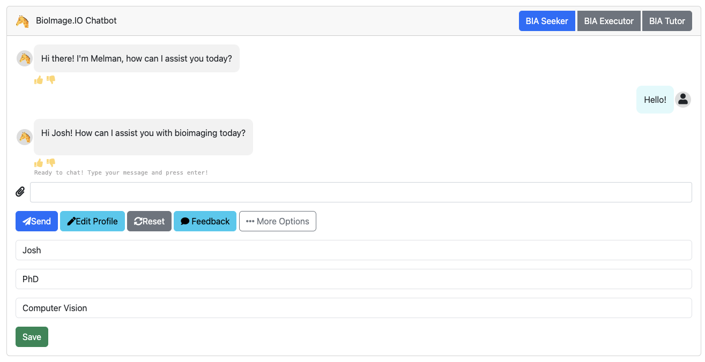
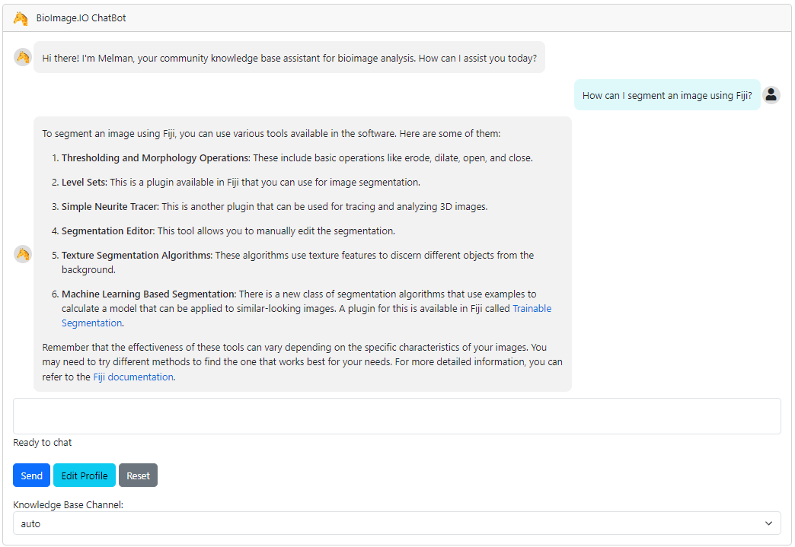
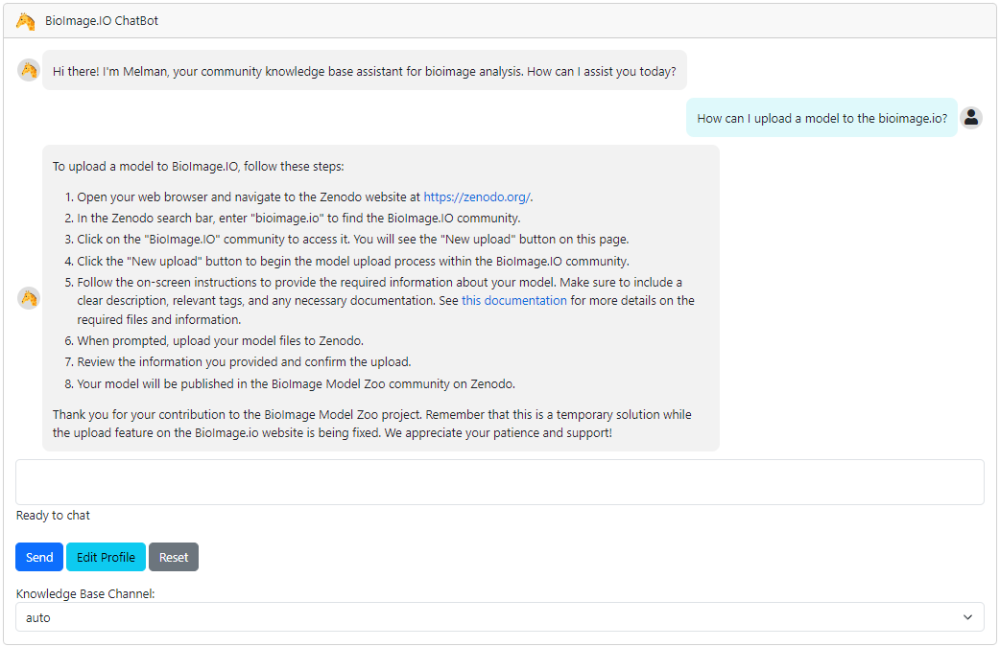
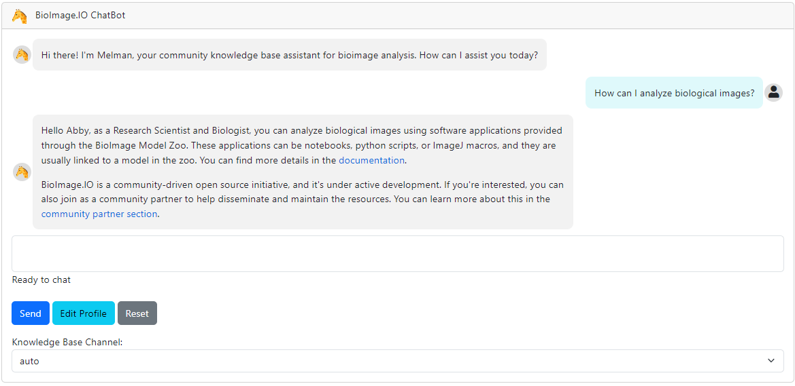
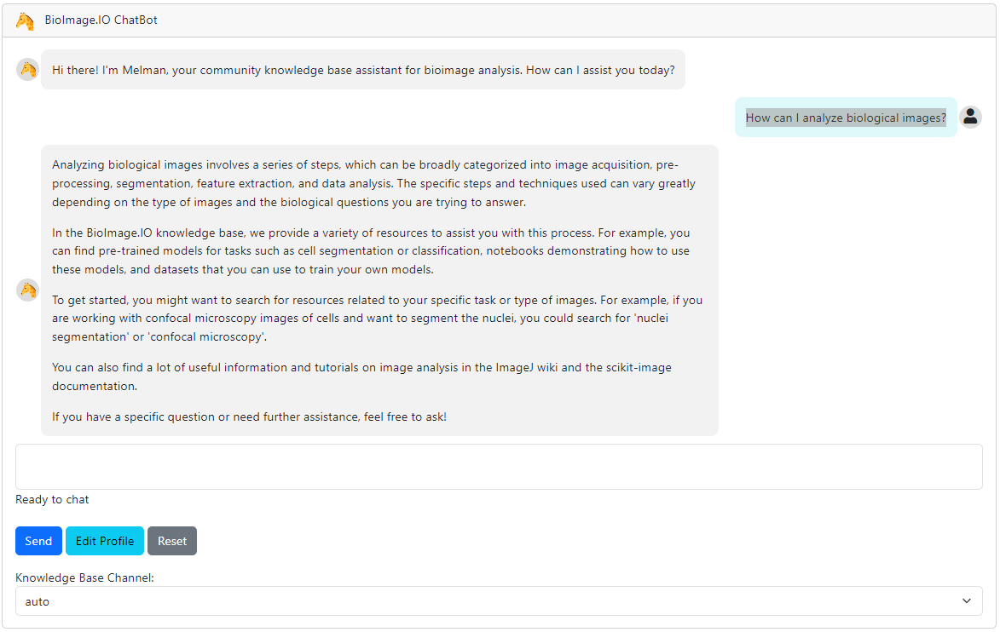

# BioImage.IO Chatbot Usage Example Guide

## Introduction
Welcome to the world of BioImage.IO Chatbot, a revolutionary conversational assistant designed exclusively for the bioimage community. Our chatbot is more than just a virtual conversationalist; it's a sophisticated AI-powered tool that offers personalized, context-aware responses by drawing from a diverse array of databases, tool-specific documentation, and structured data sources.

The BioImage.IO Chatbot is all about efficiency, knowledge enrichment, and accessibility. In this guide, we will walk you through various aspects of its functionality, so you can harness its capabilities to enhance your bioimage analysis experience. Whether you're a biologist, bioimage analyst, or developer, this guide is your key to unlocking the full potential of the BioImage.IO Chatbot.

## Basic Interaction
### How to Start a Conversation
Firstly, to make the most of your chatbot experience, consider setting your profile information. This helps the chatbot understand your background and tailor responses accordingly.

To start a conversation, simply type `Hi`  or `Hello`, and the chatbot will warmly greet you in return.

## Asking Questions
### Simple Questions
You can ask the BioImage.IO Chatbot a wide range of general and straightforward questions. The chatbot will promptly retrieve and provide you with the relevant information. For example, you can inquire about a "Community Partner" in the BioImage Model Zoo.

### Technical Questions
If you have more technical questions, the chatbot is equipped to assist you effectively. It retrieves the necessary information, summarizes it, and presents it in a simple and understandable manner. For instance, you can ask the chatbot about procedures like "How to segment an image using Fiji" or "How to upload a model to the bioimage.io repository."

### Personalization: tailored Responses
The BioImage.IO Chatbot is designed to understand and cater to the unique backgrounds and needs of its users. Whether you're a biologist, bioimage analyst, or developer, the chatbot tailors its responses to provide you with the most relevant and context-aware information.

To illustrate this personalized approach, we have two screenshots of the chatbot answering the same question: "How can I analyze biological images?" In the first screenshot, we have Abby, a biologist, posing this query. In the second screenshot, it's Abby again, but this time, she identifies as a developer. As expected, the chatbot is able to provide different feedback to Abby based on her background and needs.

### How to switch chatbot's mode
We have three assistants built in the BioImage.IO Chatbot to cater to the different purpose and needs of the users. BioImage Analysis Seeker (BIA Seeker) is designated for users that seek for information about bioimage analysis, it is equiped with 6 extensions including community-driven knowledge base, as well as online source like image.sc forum, web search. BIA Executor is desginated for users that want to execute model using BioEngine such as CellPose. BIA Tutor is designated for users that seek for tutoring in bioimage analysis, it is equiped with Bioimage Books extension combined with web search and Bioimage Model Zoo search. 

## Database Integration
Our system harnesses knowledge from a variety of valuable sources, including established databases such as [ELIXIR bio.tools](https://bio.tools) and the [ImageJ Wiki](https://imagej.net/software/imagej2/), tool-specific documentation like [deepImageJ](https://deepimagej.github.io), [ilastik](https://www.ilastik.org), and [ImJoy](https://imjoy.io/#/), and structured databases such as the [BioImage Model Zoo repository](https://bioimage.io).
In the chatbot's user interface, you'll find a list of the available knowledge base channels that the chatbot can access. s. You can choose to select a specific knowledge base channel or opt for the `auto` mode to query information from all integrated databases.

## Extension Selection
If you are interested in using specific extensions in the chatbot, you can click 'More Options' and select one or several extensions from the extension list. This way, the information provided will be exclusively by using the specified extensions you have selected.

For this example, you can select the `Search Image.cs Forum` extension and ask the chatbot for software issues.

TODO: add screenshots.

### Search in Knowledge Base 
Our system harnesses knowledge from a variety of valuable sources, including established databases such as [ELIXIR bio.tools](https://bio.tools) and the [ImageJ Wiki](https://imagej.net/software/imagej2/), tool-specific documentation like [deepImageJ](https://deepimagej.github.io), [ilastik](https://www.ilastik.org), and [ImJoy](https://imjoy.io/#/), and structured databases such as the [BioImage Model Zoo repository](https://bioimage.io). This comprehensive integration enables our chatbot to not only respond to questions related to each of these individual tools but also tackle complex inquiries that demand information from multiple databases.

To illustrate this capability, consider the following scenario: You have a Whole Slide Image (WSI) that you'd like to open with [QuPath](https://qupath.github.io), apply the Chatty-Frog model ([StarDist H&E Nuclei Segmentation](https://bioimage.io/#/?tags=chatty-frog&id=10.5281%2Fzenodo.6338614)) from BioImage.IO using deepImageJ within Fiji. How can this be accomplished? You can present this intricate question to the BioImage.IO Chatbot.

The chatbot provides a detailed breakdown of the steps required to complete the requested pipeline. This example demonstrates how our chatbot excels at efficiently retrieving and summarizing information from various sources, offering a valuable solution for your bioimage analysis needs.

### Retrieving Models
The BioImage.IO Chatbot is a versatile tool that can generate and execute code in response to user queries. This means that when a user asks about specific models available in bioimage.io, the chatbot can fetch this information by generating a custom script.

For instance, if a user inquires about the total number of models in the BioImage Model Zoo, the chatbot can effortlessly retrieve this information using a straightforward script. However, the questions can become more intricate. Users might want to know which models in bioimage.io are suitable for a particular tag or task (*i.e., segmentation*)or similar criteria. The chatbot is adept at handling these more complex queries, too.

### API Calls
The BioImage.IO Chatbot can also execute functions in external APIs, analysis pipelines, plugins, and user code. Cellpose image segmentation has been added as a Chatbot function calling extension and can be used as a template for additional APIs. Users may currently use the Cellpose API function calling by uploading a file and requesting the Chatbot to segment it either from the `auto` or `cellpose` channels.

## Conclusion
The BioImage.IO Chatbot is a powerful tool designed to provide you with accurate and personalized information from a wide range of databases. Whether you're a biologist or a developer, our chatbot is here to assist you. Feel free to explore its capabilities, ask questions, and customize your experience.

Explore more, learn more, and enjoy the benefits of BioImage.IO Chatbot!

## Additional Resources
- For documentation, visit our [GitHub repository](https://github.com/bioimage-io/bioimageio-chatbot).
- Do you have questions or need assistance? Contact us through [GitHub Issues]((https://github.com/bioimage-io/bioimageio-chatbot/issues)).
